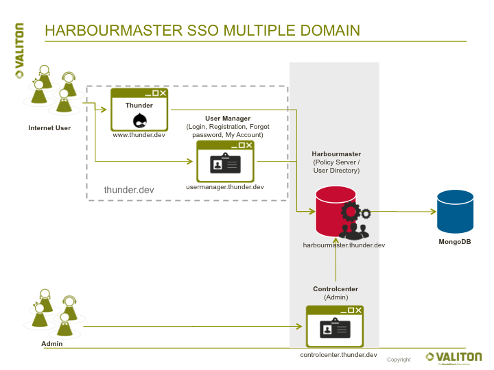

# Harbourmaster Single Sign On \(SSO\)

With the Harbourmaster Single Sign On \(SSO\), [Valiton ](https://valiton.com/)has developed a solution that focuses on the media industry. As part of the [Thunder ](http://www.thunder.org/)initiative of Hubert Burda Media, the Harbourmaster is available as a ‘Freemium’ version.

Whether for registered users, newsletter subscribers or anonymous users – all types of visitors on websites, online shops and apps, Single Sign On is essential for online businesses.

Thunder comes with built in Drupal User Management, which could be used as long you only need to allow users to login on your website. For your Mobile App, you may have considered registering via Facebook or Twitter.

With the rapid growth of your online business, and the use of various apps, websites, shops, and landing pages, the need for a Single Sign On solution has now become essential.

Some of the main strengths of SSO are:

* Private Hosting

  * Cloud scaling compatibility 
  * Hosting friendly by using [Docker](https://www.docker.com/) container

* Multi-tenant \(two tenants included in Freemium\)

* Newsletter Management \(not available in Freemium\)

  * Subscription status Sync with email service providers \(Salesforce Marketing Cloud, Elaine, etc\)
  * Integration of subscribers' status

* Management of data protection and advertising agreement

* Paid content access control \(billing component requires the Valiton product, Tallymann\)

  * CDN/Caching compatibility 

* iOS SDK \(not available in Freemium\)

* Android SDK \(not available in Freemium\)

* Cross Domain login/logout  \(not available in Freemium\)

* Login with Facebook, Twitter, Google Plus et al
* API Driven – all functions can also be accessed by third-party systems via API
* Customer self-service widget  

Valiton’s many years of development experience in [NodeJS ](https://nodejs.org/)was the base on which it implemented the applications in the Harbourmaster SSO and developed a fast and resource-efficient SSO solution as a loosely coupled architecture. Harbourmaster is also the central component for access management of premium content on publishing sites. We can perfectly apply our know-how in the field of online shops and mobile apps into the integration of third party systems.

For more information about Harbourmaster SSO please feel free to contact us directly. [kontakt@valiton.com](mailto:kontakt@valiton.com)

## System Components

The Harbourmaster SSO contains three components in the Freemium version of Thunder. The Freemium version is under the attached LICENSE.

The Core component is the [Harbourmaster](harbourmaster.md) it fully API driven. It manages User Authentication and Authorisation.

The user facing component is the Usermanager, the main feature of which is a widget that is embedded in the website and backend, and which sends confirmation emails and communicates with the Harbourmaster.

The Controlcenter gives admin/product manager/call center agents access to all necessary information. Groups and policies allow granular access control.

# [Quick Start Guide](quick-start-guide.md)

# [User Manager](Usermanager.md)

# [Control Center](control-center.md)

# [Harbourmaster](harbourmaster.md)

# [Drupal Module](drupalmodule.md)

