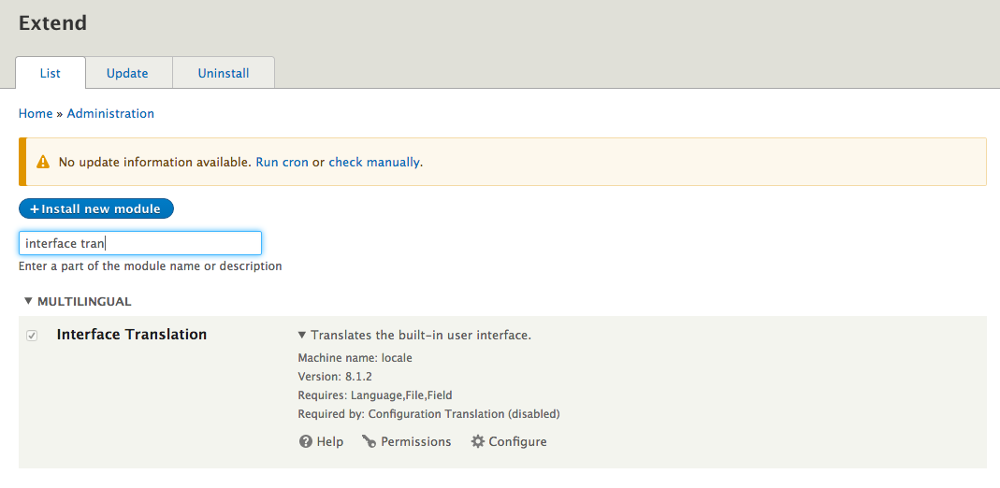
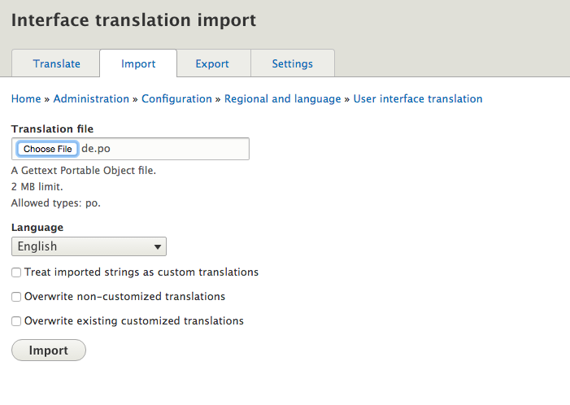
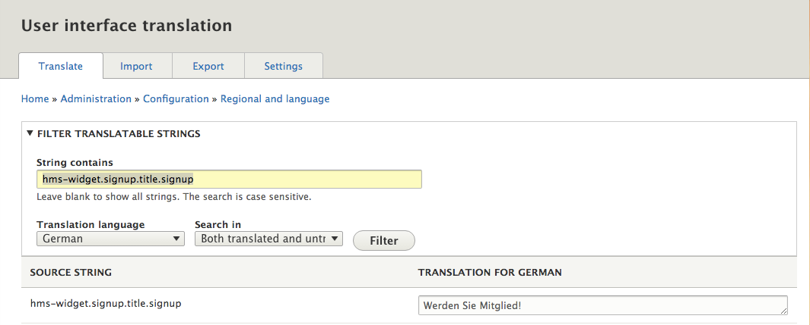

# User Manager

## About

The usermanager extends the Harbourmaster SSO. It is a dedicated web application where users of the single sign-on can manage their user account.
[https://hub.docker.com/r/valiton/usermanager/](https://hub.docker.com/r/valiton/usermanager/)

The user facing component is the usermanager; its main features are a frontend widget that is embedded in the website, and a backend that sends confirmation emails and communicates with the Harbourmaster.

### Features

* Registration
* Password Recovery
* Login/Social Login
* Logout
* My Account

  * Change User Data
  * Change Avatar
  * Change Password

* Opt-in/double opt-in

* Newsletter subscription/unsubscribe


### Backend application

The usermanager backend uses the Harbourmaster API to achieve its main tasks.
The key responsibilities of the usermanager backend are:

* User registration

  * Send confirmation email

* User Login

* Show Profile

* Edit Profile

  * User image resize and upload to Amazon S3

* Password Reset

  * Send password rest email


### Widgets

The widgets are easy to embed and customise with JavaScript applications. The Drupal Module already comes with built in integration. For all user cases there is a single widget, making placement on the page very easy. The widgets are responsive based on the twitter bootstrap grid.

The widgets are based on [Ember.js](http://emberjs.com/). Widget Overview:

* Login
* Sign-up
* Request password reset
* Profile
* Confirmation
* Password reset

### Compatibility

Ember.js uses JavaScript prototype Extensions for Array, String and Function. To avoid compatibility issues in custom JavaScript, do not use incompatible JavaScript code.

## Installation

### Configuration

The usermanager uses external Service/APIs, which need to be configured.

The minimal required configurations for the usermanager are done by ENVIROMENT variables.

**usermanager.env **file for docker run

```bash
#usermanager.env

HARBOURMASTER_USER_KEY=<enter 20 hex char># e.g. 32be04fb9495229f3e4f
HARBOURMASTER_USER_SECRET_KEY=<enter a long password>
HARBOURMASTER_TENANT=thunder  

EMAIL_FROM=<Name name@thunder.dev> #send the emails from this address. Format see https://github.com/nodemailer/nodemailer#address-formatting
EMAIL_SMTP_HOST=<host> #is the hostname or IP address to connect to (defaults to 'localhost')
EMAIL_SMTP_PORT=<port> #is the port to connect to (defaults to 25 or 465)
EMAIL_SMTP_USER=<user> #smtp server user
EMAIL_SMTP_PASS=<password> #smtp server password
EMAIL_SMTP_SECURE=<true|false> #if true the connection will only use TLS. If false (the default), TLS may still be upgraded to if available via the STARTTLS command.
EMAIL_SMTP_IGNORE_TLS=<true|false> #if this is true and secure is false, TLS will not be used (either to connect, or as a STARwwtion upgrade command).

SSO_COOKIE_DOMAIN=.thunder.dev #the domain where the sso cookie lives
SSO_COOKIE_NAME=token  #the name of the SSO cookie
SSO_WIDGET_CORS_HTTP_HOSTS=http://www.thunder.dev #add your Drupal domain here, comma separated list is possible

CROSS_DOMAIN_LOGIN_BASE_URL=http://www.thunder.local:9080/hms_cross_domain_login  #add the cross doamin login url endpoint in e.g. Drupal. The Drupal module has a config section for the url path.


BASE_URL=http://usermanager.thunder.dev #url where the usermanager will be publicly accessible
FALLBACK_URL=http://www.thunder.dev/ #fallback to this url. It is recommended to use the thunder home page, only used in case of misuse by users
```

### Docker Run

The following command requires a running Harbourmaster and redis container to link to.

```bash
docker run --name usermanager -p 80:80 --link thunder-harbourmaster:harbourmaster --link redis:redis --env-file usermanager_config.env -e NODE_ENV=docker-compose valiton/usermanager
```

### Changing UI Text

Every Text which get displayed to the user in the frontend widget can be customized. Each UI text is individually addressable in a hierarchical JSON object notation, unlike Drupal, English is not the default text.

```
"signup": {
  "title": {
    "signup": "Werden Sie Mitglied!",
    }
  }
}
```


#### Drupal local Module [Interface Translation](https://www.drupal.org/documentation/modules/locale)

The Harbourmaster Drupal Module utilizes the option to use Drupal translations in JavaScript [https://www.drupal.org/node/323109](https://www.drupal.org/node/323109)

The Drupal Module contains a de.po and a hms.pot file which can be used to translate all UI text elements.

All translation strings are prefixed with hms-widget e.g. `hms-widget.signup.title.signup`

To be able to use this you need:
1. to install the **Interface Translation** [https://www.drupal.org/documentation/modules/locale](https://www.drupal.org/documentation/modules/locale)


2. Upload the de.po file from the Harbourmaster Drupal Module:

3. Search UI Text and edit:

4. Flush Drupal cache and reload UI:


#### Language file injection

An alternative option is to edit the UI text JSON file and inject it into the docker container.

The injection uses the docker volume feature to [mount individual host files. ](https://docs.docker.com/v1.10/engine/userguide/containers/dockervolumes/#mount-a-host-file-as-a-data-volume)Currently the usermanager expects a de.js file, even if it contains English text. Multiple languages are currently not implemented.

```
./de.js:/app/assets/languages/de.js
```

When editing a de.js file remember to restart the docker container, since the files are compiled when the container starts.

```
$ docker stop thunder-usermanager
$ docker start thunder-usermanager
```

### Changing email templates

The Usermanager sends a multipart email with a text and an html version of the text. Therefore, two files are required for every email template. The email client will pick one version of the text based on email client capability and user preferences. The html email in this example is a very basic html, but could be expanded to a much richer html. Multiple languages are currently not implemented.

The email templates are created in the [ejs template language](http://www.embeddedjs.com/). Changing the email text requires the injection of the email template files into the docker container.

The `passwordRecoveryHtml.ejs` and `passwordRecoveryText.ejs`  are for sending by email if a user requests a password recovery link.
The `registrationConfirmationHtml.ejs`and `registrationConfirmationText.ejs`are for the account registration confirmation email.

```
  ./passwordRecoveryHtml.ejs:/app/views/email/forgotPassword/passwordRecoveryHtml.ejs
  ./passwordRecoveryText.ejs:/app/views/email/forgotPassword/passwordRecoveryText.ejs
  ./registrationConfirmationHtml.ejs:/app/views/email/signup/registrationConfirmationHtml.ejs
./registrationConfirmationText.ejs:/app/views/email/signup/registrationConfirmationText.ejs
```

### Skinning

The widget basic styling and grid rely on the popular [bootstrap ](http://getbootstrap.com/)CSS framework.
The `hms-widget.css` widget css is generated from a set of LESS files.
Within the generated stylesheet all widget related parts are prefixed with the `.hms-widget` class declaration to avoid overwriting other parts of the page.

That is because all imported files are called inside the parent class definition are called:

```
.hms-widget {
    @import ...
    @import "white-label.less";
}
```

To change the design of the widget you can use one of the following options depending on your knowledge of web technologies:

#### Drupal based CSS overwrite

This option describes the adaption of the widget design by replacing predefined values in an existing style sheet.

The relevant file is located inside the Harbourmaster Drupal plugin folder.
[https://github.com/valiton/harbourmaster-sso-drupal8-plugin](https://github.com/valiton/harbourmaster-sso-drupal8-plugin)

```
harbourmaster-sso-drupal8-plugin/css/white-label-static.css
```

It includes a basic set of selector classes to tackle most of the visible form fields.

Just play around with the property values \(colours, sizes, backgrounds\) and when finished, simply flush all caches \(available from the Drupal admin menu\) before reloading your page.

#### Usermanager LESS injection

Besides the ability to include a pre-compiled CSS file, we also offer a more advanced option to adapt the look and feel of the widget.

Any technical savvy developer/designer/site builder can customize the white-label.less file to meet the requirements in regards of CI and existing specifications. The injection uses the docker volume feature to [mount individual host files](https://docs.docker.com/v1.10/engine/userguide/containers/dockervolumes/#mount-a-host-file-as-a-data-volume)

```
 ./white-label.less:/app/assets/styles/less/white-label.less
```

Some basic selector groups have already been included; for further adjustments one can inspect the required DOM nodes in source code view and amend existing class or ID definitions within the style sheet.

You can change default color, size and font definitions in the variables file located at

```
./vars.less:/app/assets/styles/less/vars.less
```

When editing LESS files, remember to restart the docker container, since the files are compiled when the container starts.

```
$ docker start thunder-usermanager
$ docker start thunder-usermanager
```

If you decide to go with the LESS file option you can optionally decide not to use the  `white-label-static.css` from the Drupal Module or comment out all unnecessary declarations from the Drupal Module.

### Configure email SMPT server

The usermanager uses a SMPT Server to send email. Email will be sent with the [nodemailer ](https://github.com/nodemailer/nodemailer)npm module. The most common SMTP configurations used are exposed as environment variables.

```
EMAIL_FROM=Name name@thunder.dev     #send the mails form this address. Format see https://github.com/nodemailer/nodemailer#address-formatting
EMAIL_SMTP_HOST=<host>                #is the hostname or IP address to connect to (defaults to 'localhost')
EMAIL_SMTP_PORT=<port>                #is the port to connect to (defaults to 25 or 465)
EMAIL_SMTP_USER=<user>                #smtp server user
EMAIL_SMTP_PASS=<password>            #smtp server password
EMAIL_SMTP_SECURE=<true|false>        #if true the connection will only use TLS. If false (the default), TLS may still be upgraded to if
EMAIL_SMTP_IGNORE_TLS=<true|false>    #if this is true and secure is false, TLS will not be used (either to connect, or as a STARTTLS connection upgrade command).
```

