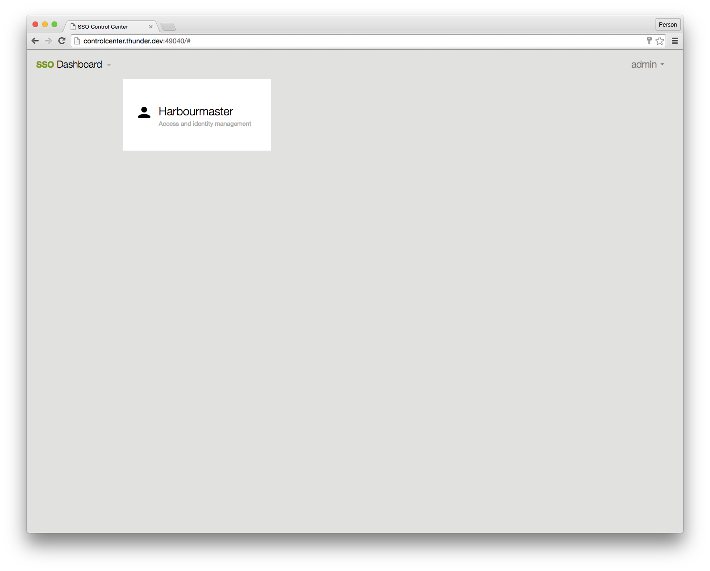

# Control Center Installation

## About

The controlcenter is a web application which provides an administration interface for the Harbourmaster SSO. It is provided as a docker container. https://hub.docker.com/r/valiton/controlcenter/

## Configuration

The necessary configuration of the controlcenter is defined with environment variables.

```bash
COOKIE_SECURE=<true|false>     #should set the login cookie only on https
REDIRECT_TO_HTTPS=<true|false> #should redirect to https
HARBOURMASTER_API_URL=<harbourmaster_api_base_url_v1>  #Base url of the harbourmaster API inclucding /v1 e.g. http://harbourmaster.thunder.dev:8080/v1
```

# Docker run

The quick start guide provides a preconfigured docker-compose file. [Quick Start Guide](quick-start-guide.md)

```bash
docker run --name thunder-controlcenter -e COOKIE_SECURE=false -e REDIRECT_TO_HTTPS=false -e HARBOURMASTER_API_URL=http://harbourmaster.thunder.dev:8080/v1 -p 49040:18040 valiton/controlcenter
```

# Control Center user documentation

## Login

Login with username/password or with user key and user secret key. The user must have the permission **cc:accessUI**. The admin user created in the seed script has complete permission.


## Controlcenter Dash Board

On the controlcenter dashboard, select Harbourmaster to manage users.



## List Users

The Control Center lists all users in paginated form on the left hand side. The list is searchable.


## User Details

The controlcenter shows all user details when clicking on a user from the list. On the user detail page the following admin actions can be done.

* Change password for the user \(requires knowledge of the user password\)
* Reset password \(assign a new randomly generated password to the user, password will be displayed once\)
* Reset secret key \(assign a new randomly generated secret key to the user, secret key will be displayed once\)

* Edit the user details

* Delete the user

* Add group to User

* Remove group from user

* Add policy to user

* Remove policy from user

* Edit user security questions

* Add entitlement to user

* Remove entitlement from user

* OAuth Callback Whitelist \(relevant for OAuth API user\)


## Create new user

The controlcenter create user has less validation than the usermanager widget used by internet users. e.g. the usermanager validates that the login name is not a email address, the controlcenter cannot perform this validation.

**Important:** A new user has no default policies and therefore cannot login; you have to add a group to the new user.


## List Groups

The controlcenter list all groups.


## Create new Group

Create a new group for a tenant. Group names should not contain any whitespaces.


## Create new Policy in  Group OR User

Create a new policy. The UI represents the policy statements JSON structure as described in the [Harbourmaster Policies](harbourmaster.md#Policies).


## List tenants

List the tenants. All Harbourmaster entities such as users and groups are attached to one and only one tenant. A move from one tenant on other list not supported. In other words, a tenant represents one set of users.


## Show tenant

Show the details of a tenant.


## Create new tenant

Create a new tenant and define the API path, which will be used in the Harbourmaster API, as well as a name. Sub-domain configuration gets ignored at this stage.

Please note: a new tenant comes with no groups, no policies, no admin user. As a admin user with cross tenant access you have to create all necessary information. The initial tenant is created by the seed script which also creates a basic set of groups and policies.


## Edit Tenant

The controlcenter allows the editing of a tenant; **please use with caution as **this can break access policies, and API access.

We do not recommend editing a tenant.


