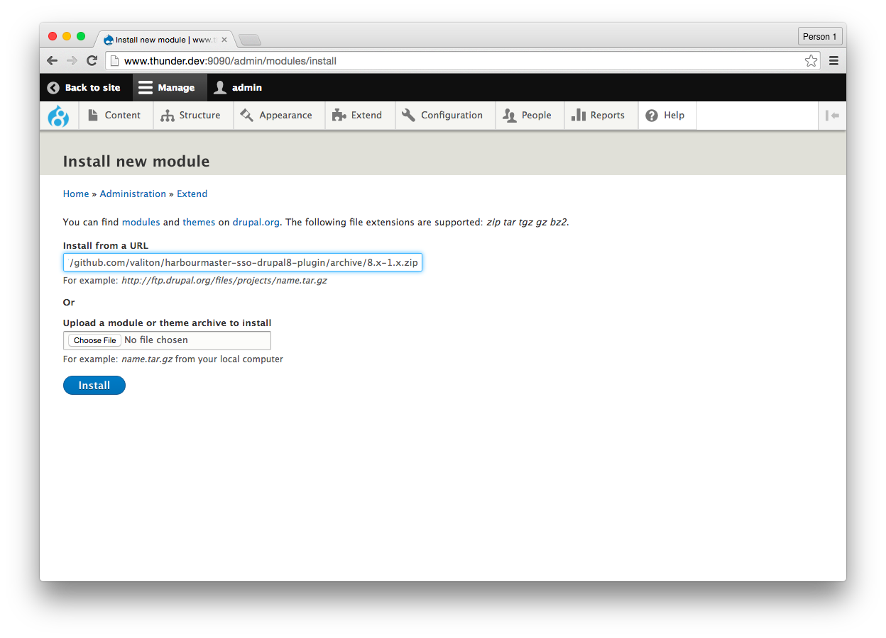
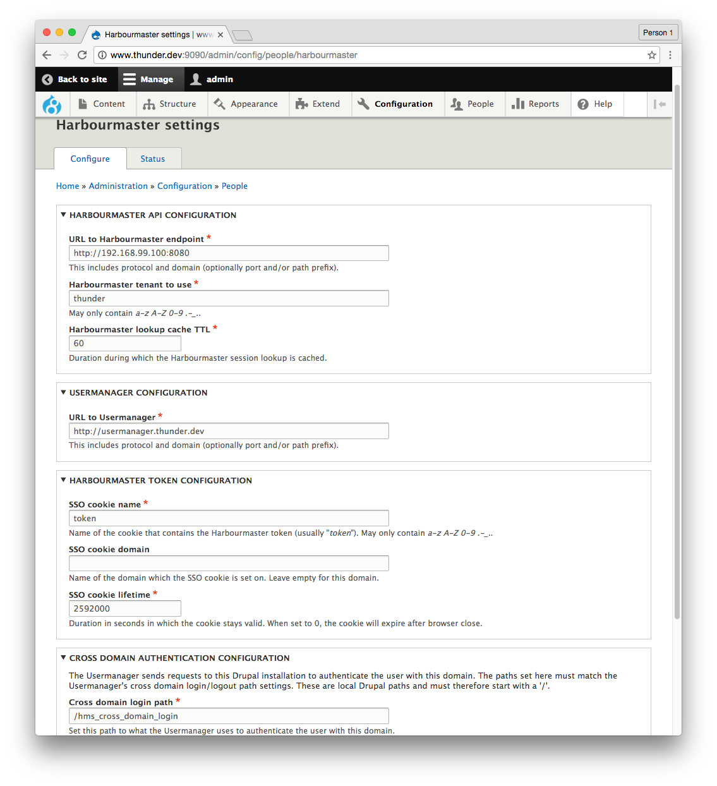

# Drupal8 / Thunder

## Install Harbourmaster SSO plugin

Github Link [https://github.com/valiton/harbourmaster-sso-drupal8-plugin](https://github.com/valiton/harbourmaster-sso-drupal8-plugin)

zip to install: [https://github.com/valiton/harbourmaster-sso-drupal8-plugin/archive/8.x-1.x.zip](https://github.com/valiton/harbourmaster-sso-drupal8-plugin/archive/8.x-1.x.zip)

Install the module

Successfully installed

Activate the module

Successfully activated

## Configuration

Configure the module

The Drupal Module needs to be configured to communicate to Harbourmaster API and includes the widget js from the usermanager.

**HMS API CONFIGURATION**

* URL to Harbourmaster endpoint 
  _Includes protocol and domain \(optionally port and/or path prefix\)._
  e.g. http://harbourmaster.thunder.dev:8080
Note if you user Docker Native for mac use the IP address of our Computer e.g. 192.x.x.x

* Harbourmaster tenant to use
  _May only contain a-z A-Z 0-9 ._
  e.g. thunder

* HMS lookup cache TTL
  _Duration during which the HMS session lookup is cached._
  e.g. 60

**USERMANAGER CONFIGURATION**

* URL to usermanager
  _Includes protocol and domain \(optionally port and/or path prefix\)._
  e.g. http://usermanager.thunder.dev

**HMS TOKEN CONFIGURATION**

* SSO cookie name
  _Name of the cookie that contains the HMS token \(usually "token"\). May only contain a-z A-Z 0-9 .-\_..SSO \_
  e.g. token
* Cookie domain

  _Name of the domain which the SSO cookie is set on._
   e.g. .thunder.dev

