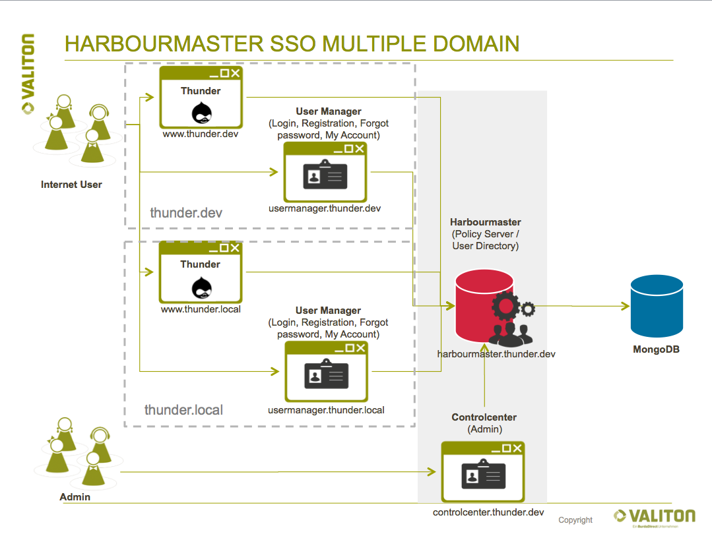

# [Quick Start Guide](quick-start-guide.md) Multi Domain Setup

With Harbourmaster it is possible allow users to login with the same username and password on multiple top level domains e.g. `tunder.dev` and `thunder.local`. This requires to set up multiple usermanagers, each dedicated to their own domain but each communicating with the same Harbourmaster. This setup allows for the most customization since each usermanager can be configured individually \(see chapter [Usermanager\)](/Usermanager.md).



It is possible to automatically log in users on all SSO domains with one single login action, also known as **cross domain login**. This feature relies on third-party cookies \(setting a cookie on a domain which the user is not currently visiting\). Some browser block third-party cookies, which is why this feature is not compatible with all browsers.

This guide aims to provide you with a quick way to set up a local multi usermanager installation. It is assumed that you have followed our [Quick Start Guide](/quick-start-guide.md) to the point where the Harbourmaster, Usermanager and Controlcenter are all running on your system.

## Adding a second Usermanager to the [Quick Start Guide](quick-start-guide.md)

The Harbourmaster quick start repository comes with the [docker-compose-second-domain.yml](quickstart/docker-compose-second-domain.yml) which is pre-configured to add a second Usermanager to the [Quick Start Guide](/quick-start-guide.md). This Usermanager will be running under the `usermanager.thunder.local` domain.

Stop the docker-compose run from the Quick Start Guide and start it again with providing both docker compose files

```bash
cd harbourmaster-docs/quickstart/
docker-compose -f docker-compose.yml -f docker-compose-second-domain.yml up
```

**Add /etc/hosts entries**

Create the following entry in your /etc/hosts file. If the second Usermanager's Docker container is running non-locally, replace the IP address in this entry accordingly.

```bash
127.0.0.1 usermanager.thunder.local www.thunder.local
```

### Accessing the applications

To access your second Usermanager, simply point your web browser to [http://usermanager.thunder.local/demo/](http://usermanager.thunder.local/demo/).

You should now have two Usermanagers running under two different domains: `thunder.local` and `thunder.dev`. Both Usermanagers are communicating with the same Harbourmaster, allowing users to log in accross multiple domains.

_Note concerning the Drupal Module installation: In the **URL to usermanager** option, use [http://usermanager.thunder.local](http://usermanager.thunder.local)_

